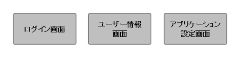
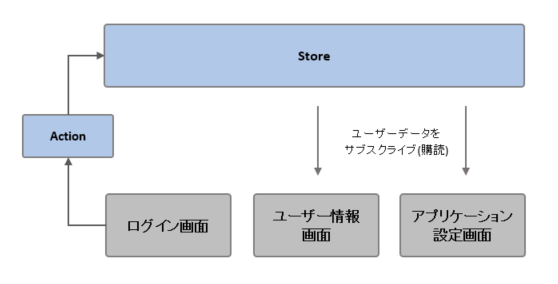
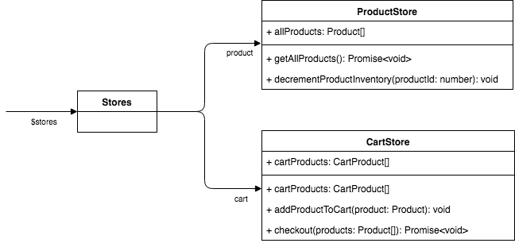

# アプリケーションのデータ管理

Vue のように複数のコンポーネントでアプリケーションの画面が構成される場合、アプリケーションであつかうデータをどのように管理するか考える必要があります。

## なぜデータ管理の仕組みが必要なのか

次のようにログインによって影響をうける画面コンポーネントの構成があったとします。



例えばユーザーがログインすると、「ユーザー情報画面」ではログインユーザーの情報を表示したり、「アプリケーション設定画面」ではログインユーザーの権限によって表示項目を切り替えたりする必要があります。

各画面コンポーネントがログイン後にユーザーデータを必要とすることは分かりましたが、ユーザーデータをどのように各画面にわたしてあげたらよいでしょうか？

各コンポーネントにデータを受け渡してあげる仕組みとして有名なのが **Flux** や **Redux** になります。

これら Flux や Redux の仕組みをざっくり説明した図が次になります。



まず **Store** ですが、ここにはアプリケーションであつかうデータがすべて保管されています。各コンポーネントはこの Store に保管されているデータをサブスクライブ(購読)することで、対象のデータに変更があった際そのデータを受け取ることができます。

次に **Action** です。Store に対してデータを追加、更新、削除するには Action を経由しておこないます。データの操作を Action に限定することで Store はデータ変更を検知することができ、またサブスクライブしているコンポーネントに対して変更されたデータをわたすことができます。

このようなデータ管理の仕組みを利用することにより、複数のコンポーネントで画面が構成されていた場合でもデータの受け渡しをおこなうことが可能になります。

## アプリケーションデータを操作する

本プロジェクトでは上記の考えを参考にデータ管理の仕組みを実装しています。ここではデータ管理の概要を見ていきましょう。

アプリケーションであつかうデータは **State** に保管されます。State は適切なデータの塊です。

State にアクセスするには対応する **Store** を経由する必要があります。Store にはデータを取得するための getter や、データを編集するための setter、メソッドなどが定義されます。

アプリケーションデータへのアクセスは必ず Store を経由します。これによりアプリケーションデータへの意図しない変更を防ぐことができます。

次の図は利用者がデータ管理の仕組みにアクセスするためのインタフェースです。今回は例としてショッピングカートを想定したインタフェースを提供しています。



ショッピングカートをデータ設計に落とし込んだ結果、**商品**(`ProductStore`)と**カート**(`CartStore`)という 2 つの Store が作成されました。Store にはアプリケーションデータへのアクセスに必要なプロパティとメソッドがインタフェースとして提供されます。

`ProductStore`には主に次のようなインタフェースが提供されます:

- `allProducts`: 全商品一覧が取得できる getter。
- `getAllProducts()`: API から商品一覧を取得するメソッド。
- `decrementProductInventory()`: 商品の在庫を 1 つ減らすメソッド。

`CartStore`には主に次のようなインタフェースが提供されます:

- `cartItems`: カートに入っている商品一覧を取得できる getter。
- `addProductToCart()`: カートに商品を追加するメソッド。
- `checkout()`: カートに入っている商品を確定するメソッド。

### 対象データをサブスクライブ(購読)する

本プロジェクトのすべての Vue コンポーネントは`this.$stores`で Store にアクセスすることができます。`$stores`は各 Store を保持しているので、`this.$stores.cart`のように対象の Store にアクセスすることでアプリケーションデータを操作できます。

ここではサブスクライブ(購読)の実装方法を説明します。対象データをサブスクライブすると、対象データに変更があった場合リアクティブな反応が起こり、自動で画面が更新されます。

`src/views/shopping-view/index.vue`

```html
<template>
  <div v-for="(product, index) in m_cartProducts" …>
    …
  </div>
</tamplate>

<script lang="ts">
@Component
export default class CartModal extends mixins(BaseComponent) {
  …
  get m_cartProducts(): CartProduct[] {
    return this.$stores.cart.cartProducts
  }
}
</script>
```

サブスクライブするには getter を用意し、この中で Store が提供するプロパティにアクセスするだけでサブスクライブ状態になります。

上記コードでは`cart.cartItems`をサブスクライブしており、このプロパティに変更、つまりカートに入っている商品一覧または商品自体を変更すると、画面に表示されているカートの商品一覧も自動で更新されます。

`cart.cartItems`は配列ですが、配列への追加、削除はもちろん、配列のアイテム(つまり商品オブジェクト)のプロパティに変更があってもリアクティブな反応が起こります。

### 対象データを変更する

アプリケーションデータの変更は Store が提供する setter またはメソッドで行ないます。これ以外にアプリケーションデータを変更する手段はありません。

例えば Store で getter を提供していたとして、この getter の値を変更してもアプリケーションデータは変更されません。なぜなら getter が提供するデータはアプリケーションデータのコピーだからです（コピーである理由は以降で説明します）。

## データ管理の仕組みを実装する

ここまではアプリケーションデータを操作する方法を見てきましたが、以降ではアプリケーションデータを管理するための仕組みを見ていくことにします。

### アプリケーションデータを保管する State

Store はアプリケーションデータにアクセスするためのプロパティとメソッドを提供すると説明しましたが、アプリケーションデータ自体も保管します。このデータを保管する箱を **State** と呼びます。

次のコードでは State を定義し、Store のコンストラクタで定義した State を`BaseStore#f_initState()`で初期化しています。

`src/stores/product-store/index.ts`

```ts
interface ProductsState {
  all: Product[]
}

@Component
class ProductsStoreImpl extends BaseStore<ProductsState> implements ProductsStore {
  constructor() {
    super()
    this.f_initState({
      all: [],
    })
  }
}
```

ここでは`ProductsState`という State を定義し、`BaseStore`のジェネリクスに指定しています。これにより`f_initState()`で初期化に必要なプロパティが足りなかったり、必要ないプロパティが指定された場合、コンパイラがこれらのエラーを知らせてくれます。

State は Store の内部からしかアスセスできません。Store から State へは`this.f_state`でアクセスできます。次は State にアクセスしている例です。

```ts
const allProducts = this.f_state.all
```

アプリケーションデータを変更するということは、State の保持するデータを変更するのと同じ意味になります。アプリケーションデータを変更するには次のように State のデータを変更します。

```ts
const firstProduct = this.f_state.all[0]
firstProduct.inventory--
```

### アプリケーションデータはコピーを返す！

Store に getter やメソッドを定義することで、利用者にアプリケーションデータを提供することができます。ただし getter やメソッドが返すデータはアプリケーションデータの**コピーでなければなりません**。

```ts
import {NoCache} from '../../components'

@Component
class ProductsStoreImpl extends BaseStore<ProductsState> implements ProductsStore {
  @NoCache
  get allProducts(): Product[] {
    // アプリケーションデータのコピーを返している
    return this.$utils.cloneDeep(this.f_state.all)
  }
}
```

なぜコピーを返す必要があるのでしょうか？この理由をさぐるためにコピーではなくアプリケーションデータをそのまま返すケースを考えてみましょう。

```ts
  get allProducts(): Product[] {
    // アプリケーションデータをそのまま返している
    return this.f_state.all
  }
```

この getter の利用者は受け取ったデータを編集用データとして利用することを想定しています。利用者はこのデータを一旦編集したのち、編集内容を検証して、検証結果が正常だった場合だけ編集を確定しようと考えていました。

しかしここでは getter からアプリケーションデータをそのまま受け取っているため、データが編集されると即編集内容が確定されることになります。これにより他の画面でこの getter を利用している場合、編集内容が検証される前にリアクティブな反応が起こり、画面の更新が行われれてしまします。

getter の利用者が受け取ったデータを表示に利用するか編集に利用するかを設計時にすべて把握するのは困難です。このためアプリケーションデータはコピーを返すことを前提にする必要があるのです。

#### @NoCache ってなに？

Vue では算出プロパティ（TypeScript では getter が算出プロパティにあたる）はキャッシュされます。つまり算出プロパティが返す値に変更がないと算出プロパティは実行されず、キャッシュされた値が返されます。

getter に`@NoCache`をつけると算出プロパティがキャッシュをしなくなります。

次のコードは上記で出てきた「アプリケーションデータのコピーを返す」コードですが、ここでは`@NoCache`を削除してあります。`@NoCache`を削除するとどうなるか考えてみましょう。

```ts
@Component
class ProductsStoreImpl extends BaseStore<ProductsState> implements ProductsStore {
  get allProducts(): Product[] {
    // アプリケーションデータのコピーを返している
    return this.$utils.cloneDeep(this.f_state.all)
  }
}
```

この getter（算出プロパティ）はキャッシュされます。このため最初の呼び出しは`this.f_state.all`のコピーが返されますが、2 回目以降の呼び出しでは getter は実行されず、キャッシュの値が返されます。

つまり 1 回目と 2 回目以降の呼び出しで取得される値は同じ配列の参照となり、コピーを返している意味がなくなっています。

では`@NoCache`を付与するとどうなるでしょう？`@NoCache`を付与すると 1 回目と 2 回目以降の呼び出しすべてで異なる配列が返されます。また配列内の各アイテムもコピーされるので、配列内のアイテムもすべてが異なります。

このように`@NoCache`を付与することで getter の利用者はいろいろ考えずに取得した値を安心して編集用データとして利用できるようになります。
