# Google ログインで認証する

## Google ログインを有効にする

1. [Firebase console](https://console.firebase.google.com/) で対象のプロジェクトを選択します。

2. 次の順番にクリックします。

  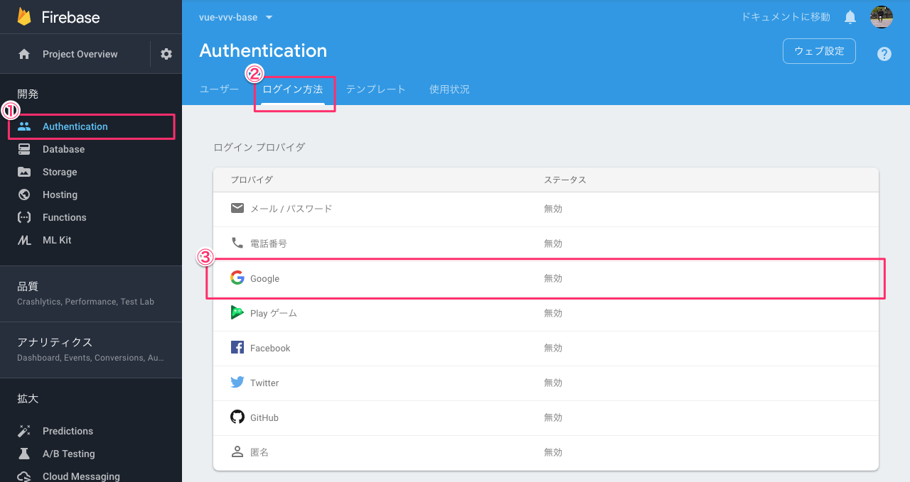

3. 次のダイアログが表示されるので、「有効にする」を設定し、「保存」を押下します。

  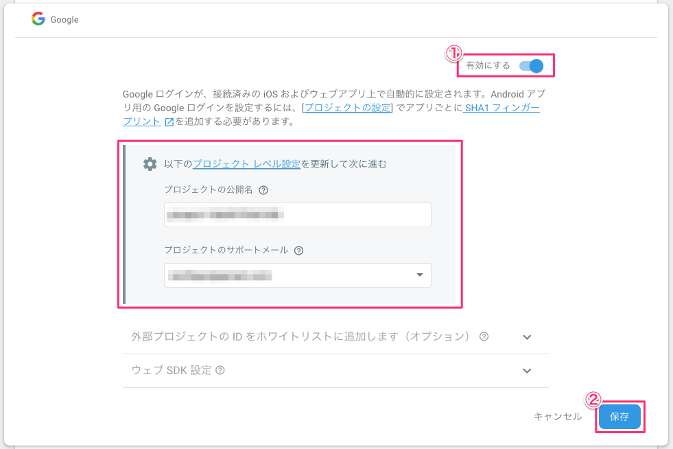

  ちなみに、中央の赤枠にある「プロジェクトの公開名」と「プロジェクトのサポートメール」は、次の手順でいつでも変更することができます。

  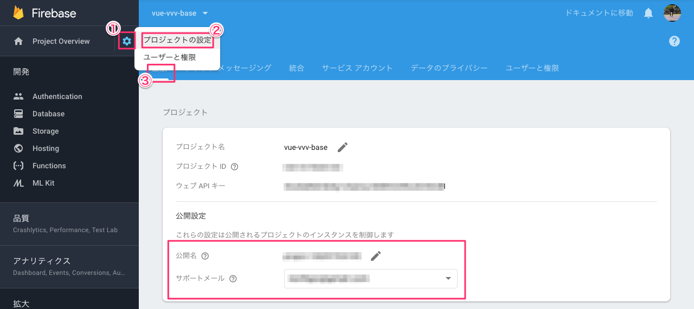

## Google アカウントでログインする

1. 次のコマンドでアプリケーションを起動します。

  ```console
  $ yarn dev
  ```

2. 起動したらブラウザで http://localhost:5000 にアクセスします。

  画面右上のメニューボタンを押下するとメニューが表示されるので、このメニューから「Sign in」を選択します。

  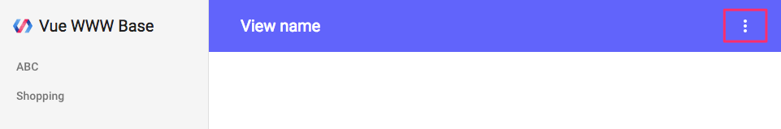

3. ダイアログが表示されるので「Sign in with Google」を選択します。

  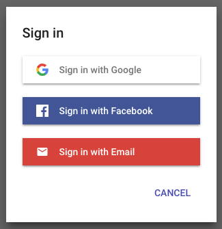

4. Google のログイン画面にリダイレクトされるので、どのアカウントでログインするか選択します。

  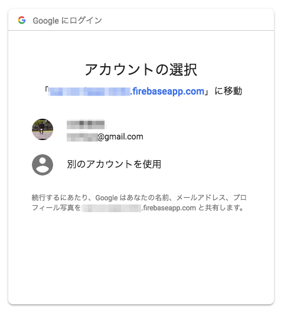

5. 次の画面が表示されるので赤枠の「詳細」を押下し、「XXX.firebaseapp.com（安全ではないページ）に移動」リンクを押下します。

  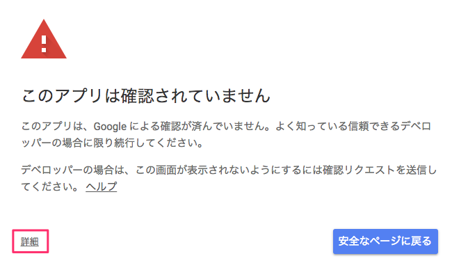

  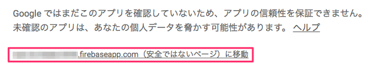

6. 選択された Google アカウントの個人情報にアプリケーションがアクセスしてよいか確認を求められます。アクセスを許可するために赤枠の「許可」を押下します。

  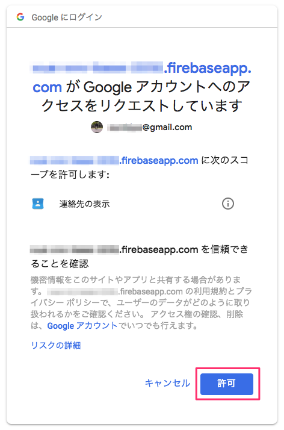

7. 以上でアプリケーションに Google アカウントが登録され、アプリケーション画面の右上に Google のアカウント画像が表示されます。

  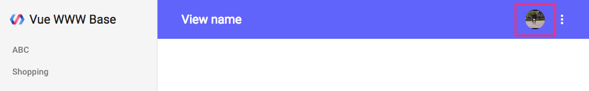

## Google アカウントへのアクセス権限を解除する

Google アカウントでアプリケーションにログインすると、その過程でアプリケーションが Google アカウントの個人情報にアクセス可能な状態になります。

ここではそのアクセス権限を解除する方法を示します。

1. 次のURLで Google へログインします。

  https://accounts.google.com/Login

2. Google アカウントの管理画面が表示されたら、赤枠の「アカウントにアクセスできるアプリ」を押下します。

  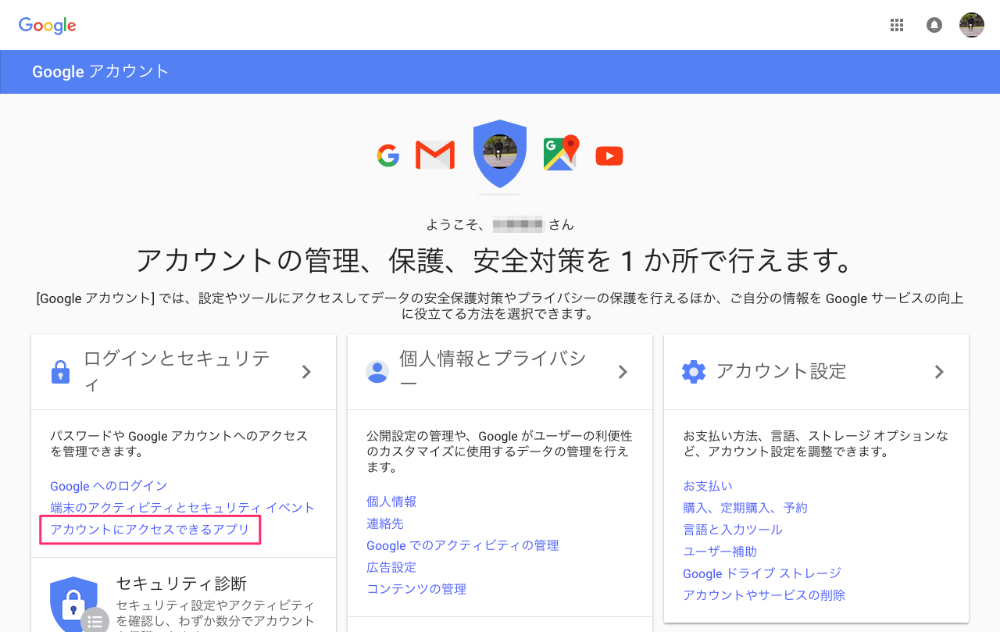

3. 次の画面が表示されたら赤枠の「アプリを管理」を押下します。

  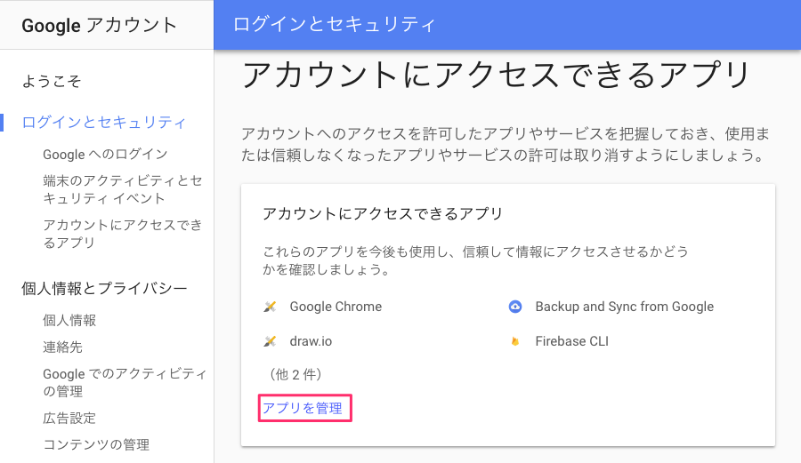

4. 「アカウントにアクセスできるサードパーティアプリ」と「Google でログイン」に本アプリケーションの名前が表示されるので、どちらか一方を押下します。

  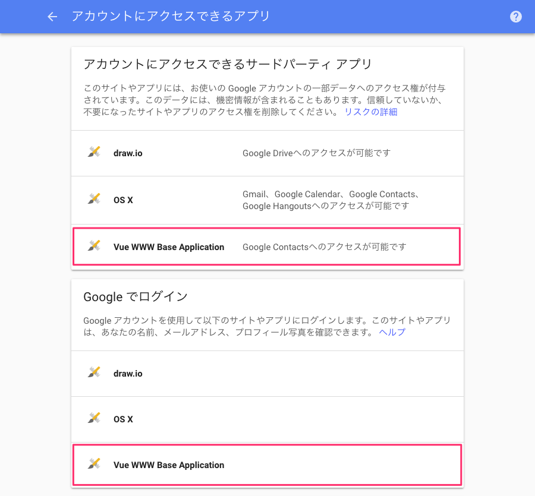

5. 押下した箇所が展開されるので、赤枠の「アクセス権の削除」を押下します。

  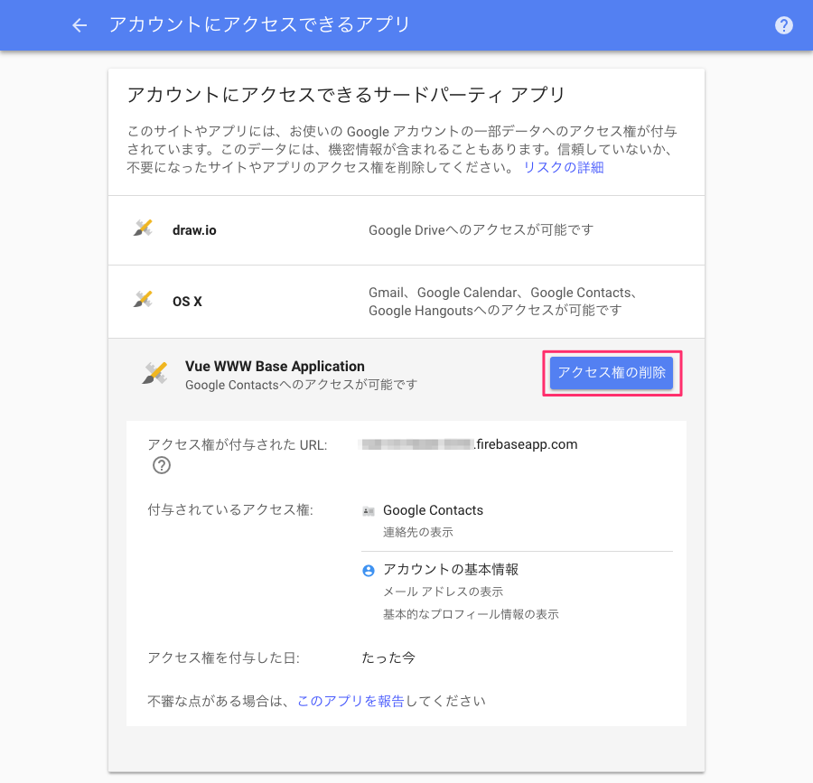

6. 確認ダイアログが表示されるので「OK」を押下します。

7. 以上でアクセス権限が解除されます。以降アプリケーションから Google アカウントでログインしようとした場合、権限を付与するための手順が再度行われることになります。
