# メール / パスワードで認証する

## メール / パスワード ログインを有効にする

1. [Firebase console](https://console.firebase.google.com/) で対象のプロジェクトを選択します。

2. 次の順番にクリックします。

  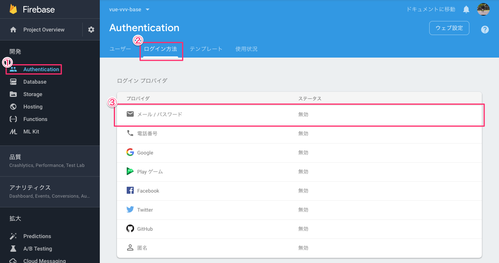

3. 次のダイアログが表示されるので、「有効にする」を設定し、「保存」を押下します。

  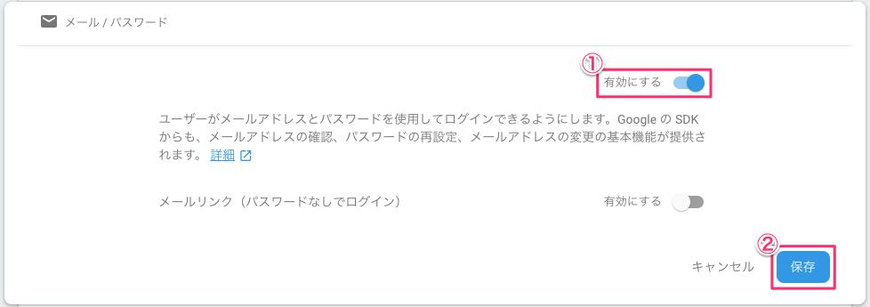

## メール / パスワード でアカウントを作成する

1. 次のコマンドでアプリケーションを起動します。

  ```console
  $ yarn dev
  ```

2. 起動したらブラウザで http://localhost:5000 にアクセスします。

  画面右上のメニューボタンを押下するとメニューが表示されるので、このメニューから「Sign in」を選択します。

  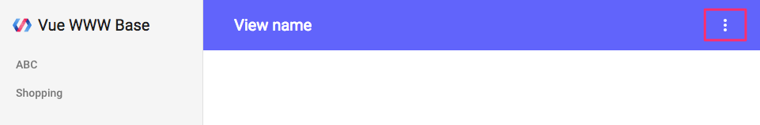

3. ダイアログが表示されるので「Sign in with Email」を選択します。

  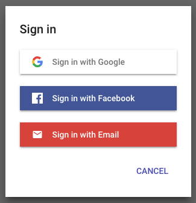

4. Email を入力し、「NEXT」を押下します。

  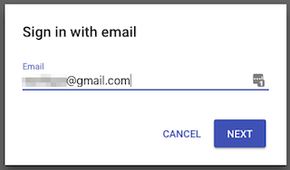

5. Display name と Password を入力し、「SAVE」を押下します。

  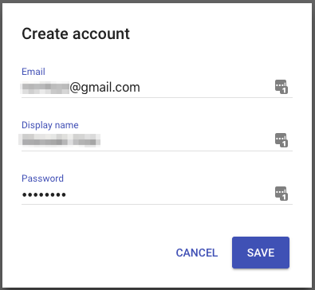

6. 確認メールが送信された旨を示す画面が表示されます。

  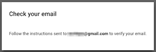

7. 確認メールに記載されているリンクをクリックすると、メールアドレスが確認された旨を示す画面が表示されるので、「続行」を押下します。

  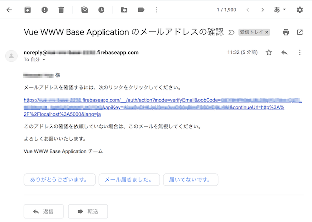

  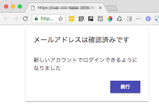

8. 以上でアプリケーションにアカウントが登録され、アプリケーション画面の右上にアカウント画像が表示されます。

  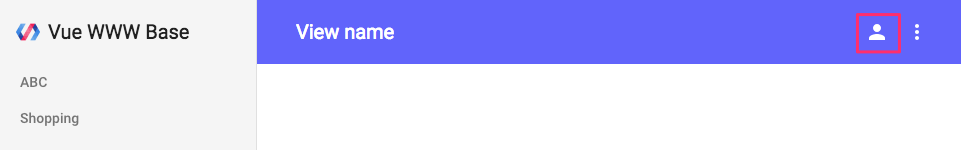

## パスワードを変更する

1. ログアウトした状態から次の画面を表示し、アカウント登録した Email を入力して「NEXT」を押下します。

  

2. 赤枠のリンクを押下します。

  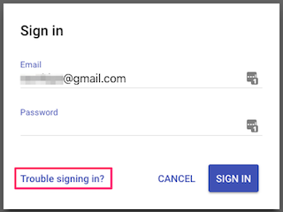

3. パスワード変更を行うためのメール送信を問う画面が表示されるので「SEND」を押下します。

  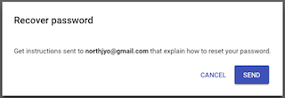

4. メールに記載されているリンクをクリックすると、パスワード変更画面が表示されるのでパスワードを入力し、「保存」を押下します。

  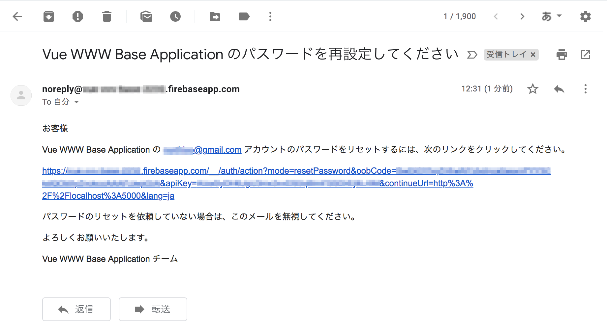

  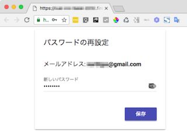

5. 以上でパスワード変更は完了です。

  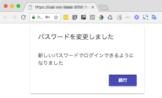

## メールアドレスを変更する

1. ログインした状態から、画面右上のメニューボタンを押下するとメニューが表示されるので、このメニューから「Change email」を選択します。

  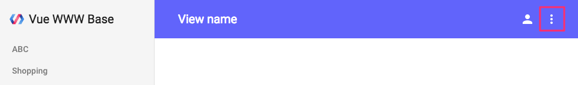

2. 新しいメールアドレスを入力し、「NEXT」を押下します。

  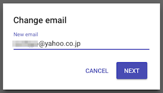

3. 確認メールが送信された旨を示す画面が表示されます。

  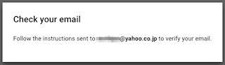

4. 確認メールは2種類送られます。1つは変更前のメールアドレスに変更された旨を知らせるメール。もう1つは変更されたメールアドレスの確認メールです。

  a. 次は変更された旨を知らせるメールです。

  ※変更を知らせるメールは何度かメールアドレスを変更しても最初に登録されたメールアドレスに送信されるようです。

  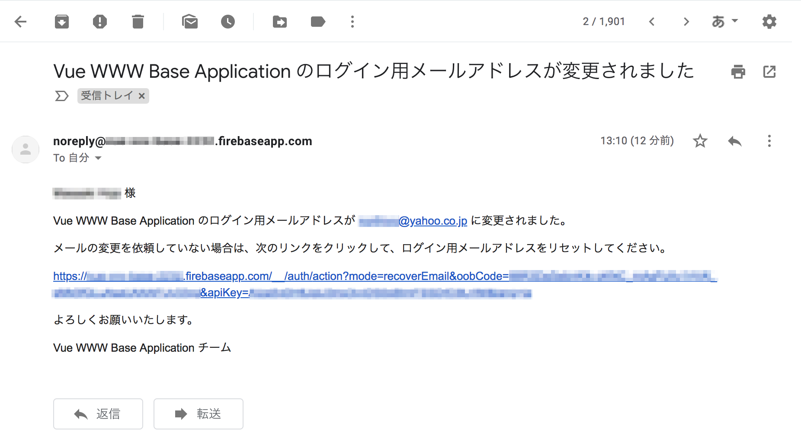

  b. 次は確認メールです。リンクを押下することでメールアドレス変更が完了します。

  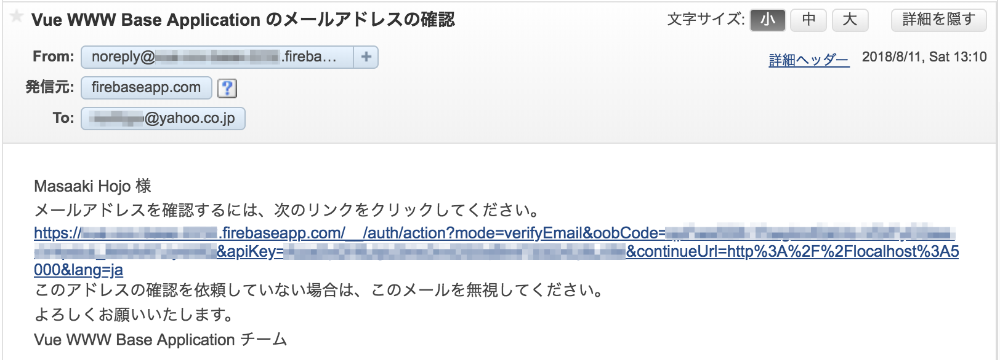

## メールのテンプレートを編集する

「メールアドレスの確認メール」、「パスワードの変更メール」、「メールアドレス変更メール」の文面はテンプレートが用意されており編集することができます。

1. [Firebase console](https://console.firebase.google.com/) で対象のプロジェクトを選択します。

2. 次の順番にクリックします。

  

またテンプレートは多言語対応されており、さまざまな言語のテンプレートを用意することができます。テンプレート言語の切り替えは、上記キャプチャの「テンプレート言語」横にあるエディットアイコンから行うことができます。
