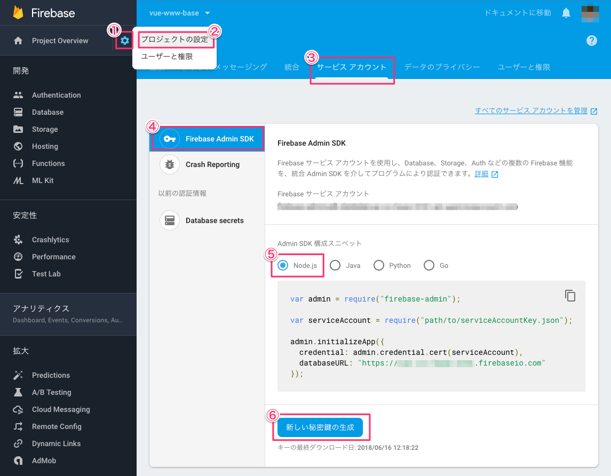
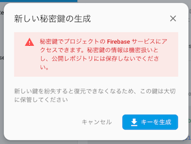

# Firebase Admin SDK の設定

Firebase Admin SDK を設定することで、Firestore が提供するサービスの特権環境を構築することができます。これにより 本プロジェクトでは Firestore へのサンプデータ投入やバックアップといった機能を実行することができるようになります。

特権環境の詳細については [サーバーに Firebase Admin SDK を追加する](https://firebase.google.com/docs/admin/setup?hl=ja) を参照ください。

## Firebase Admin SDK の秘密鍵を生成する

1. [Firebase console](https://console.firebase.google.com/) で対象のプロジェクトを選択します。

2. 次の順番にクリックします。

  

3. 次のダイアログが表示されたら「キーを生成」を押下し、秘密鍵ファイルをダウンロードします。

  
4. ダウンロードしたファイルは`serviceAccountKey.json`にリネームし、プロジェクトの直下に配置します。

  
