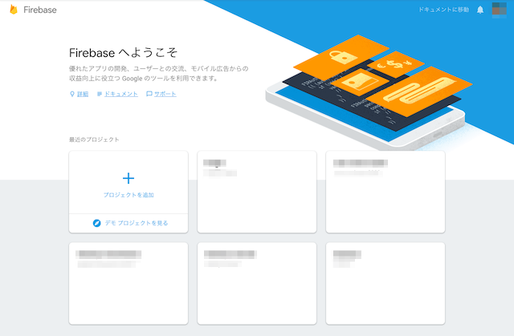
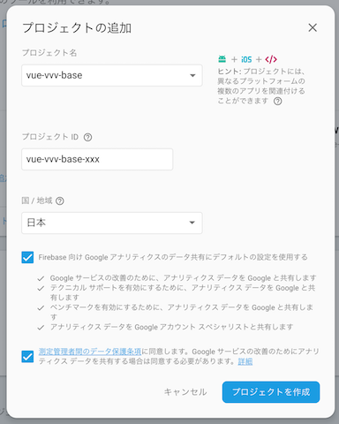
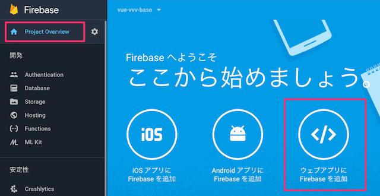
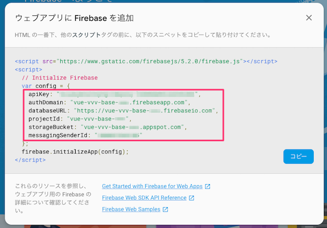

# アプリケーション設定

## Firebase プロジェクトの作成

[Firebase console](https://console.firebase.google.com/) でプロジェクトを追加します。



ダイアログが表示されたら次のように入力を行い、「プロジェクトを作成」を押下します。



プロジェクトの完了を示すダイアログへ遷移したら「次へ」を押下すると、作成されたプロジェクトの管理画面が表示されます。

## Firebase の初期設定

「Project Overview」を選択し、「ウェブアプリに Firebase を追加」をクリックします。



次のようなダイアログが表示されるので、赤枠の部分をコピーします。



次のファイルを開き、上記でコピーした内容を貼り付けます。

`src/app/config/index.ts`

```ts
export abstract class Config {
  …
  firebase: {
    apiKey: string;
    authDomain: string;
    databaseURL?: string;
    projectId?: string;
    storageBucket?: string;
    messagingSenderId?: string;
  } = {
    //↓↓↓↓↓↓↓↓↓↓↓↓↓↓↓↓↓↓↓↓↓↓↓↓↓↓↓↓↓↓↓↓↓↓↓↓↓↓↓↓↓↓↓↓↓↓↓↓
    apiKey: '<API_KEY>',
    authDomain: '<PROJECT_ID>.firebaseapp.com',
    databaseURL: 'https://<DATABASE_NAME>.firebaseio.com',
    projectId: '<PROJECT_ID>',
    storageBucket: '<BUCKET>.appspot.com',
    messagingSenderId: '<SENDER_ID>',
    //↑↑↑↑↑↑↑↑↑↑↑↑↑↑↑↑↑↑↑↑↑↑↑↑↑↑↑↑↑↑↑↑↑↑↑↑↑↑↑↑↑↑↑↑↑↑↑↑
  };
}
```

貼り付けた内容には、[Authentication](https://firebase.google.com/docs/auth/?hl=ja)、[Cloud Storage](https://firebase.google.com/docs/storage/?hl=ja)、[Cloud Firestore](https://firebase.google.com/docs/firestore/?hl=ja)、[
Firebase Cloud Messaging](https://firebase.google.com/docs/cloud-messaging/?hl=ja) に接続するための情報が含まれています。

## Firebase の初期化

次のコードでは Firebase の初期化を行っています。上記の設定内容は`firebase.initializeApp()`の引数に渡され、Firebase の初期化に使用されます。

`src/app/config/index.ts`

```ts
export abstract class Config {
  constructor() {
    firebase.initializeApp(this.firebase);
  }
}
```

[Authentication](https://firebase.google.com/docs/auth/?hl=ja)、[Cloud Storage](https://firebase.google.com/docs/storage/?hl=ja)、[Cloud Firestore](https://firebase.google.com/docs/firestore/?hl=ja)、[
Firebase Cloud Messaging](https://firebase.google.com/docs/cloud-messaging/?hl=ja) など Firebase のサービスを利用するには上記の初期化が事前におこなわれている必要があります。

このため、この初期化の実行はアプリケーション開始時におこなわれるようになっています。
