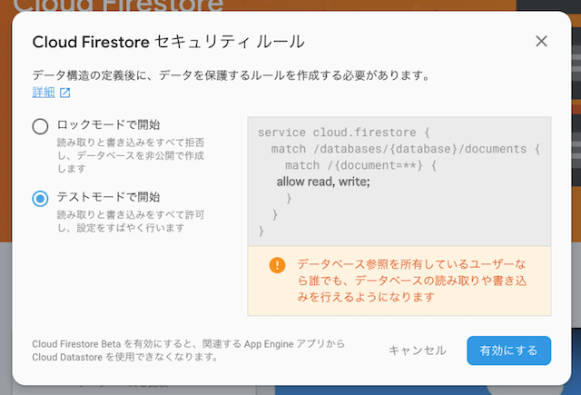
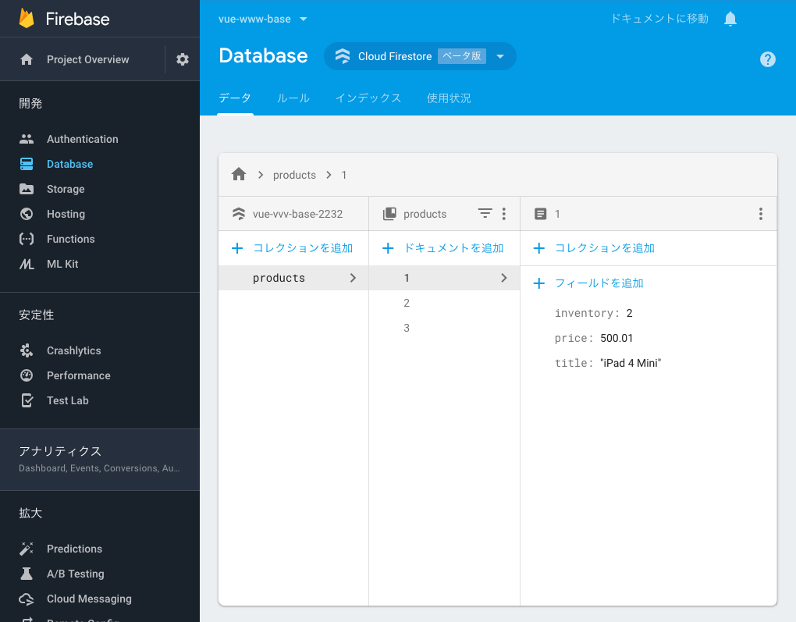

# Firestore を使ってみる

## Firestore を有効にする

1.  [Firebase console](https://console.firebase.google.com/) で対象のプロジェクトを選択します。

2.  左メニューで「Database」を選択すると、次のような画面が表示されるので、「Create Database」を押下します(この画面は今後変更される可能性があります)。

  

3.  次のダイアログが表示されるので、「テストモードで開始」を選択し、「有効にする」を押下します。

  

## Firestore にサンプルデータを投入する

次のコマンドで Firestore にサンプルデータを投入することができます。

```console
$ yarn db:restore
```

コマンドが成功すると次のようにサンプルデータを確認することができます。



## Firestore の初期化

`BaseStore`は全ての Store のベースクラスです。このベースクラス中で Firestore のインスタンスを初期化しています。

Firestore のインスタンスの初期化は「一度だけ」おこなわれます。つまりこのベースクラスに対するサブクラスが複数あった場合でも、初期化がおこなわれるのは一度だけです。

`src/app/stores/base.ts`

```ts
import * as firebase from 'firebase';
import 'firebase/firestore';

export abstract class BaseStore<S> extends Vue {
  constructor() {
    super();
    this.m_initFirestore();
  }

  static m_db: firebase.firestore.Firestore;

  get f_db(): firebase.firestore.Firestore {
    return BaseStore.m_db;
  }

  /**
   * Firestoreを初期化します。
   */
  m_initFirestore(): void {
    // Firestoreのインスタンスが既に初期化されている場合、処理を抜ける
    if (BaseStore.m_db) return;

    // Firestoreインスタンスを初期化
    BaseStore.m_db = firebase.firestore();
    // Firestoreで日付オブジェクトを扱うのに必要な設定
    // 現段階ではこの設定がないとエラーになるため必須
    BaseStore.m_db.settings({ timestampsInSnapshots: true });
  }
}
```

## Firestore を使ってみる

上記の`BaseStore`をでは Firestore のインスタンスを`f_db`に格納しています。サブクラスではこの変数を使用して Firestore からデータを取得することができます。

次にデータ取得の例を示します。このコードは以下に示すファイルに記述することで実際に動かして試すことができます。動きを確認したい場合は試してみてください。

`src/app/stores/product-store/index.ts`

```ts
@Component
export class ProductStoreImpl extends BaseStore<ProductState> implements ProductStore {
  created() {
    ...
    this.logAllProducts();
  }

  async logAllProducts(): Promise<void> {
    const snapshot = await this.f_db.collection('products').get();
    snapshot.forEach((doc) => {
      console.log('product:', doc.data());
    });
  }
}
```
