# Flexible Layout

- [概要](#overview)
- [Horizontal レイアウトと Vertical レイアウト](#horizontal-and-vertical-layout)
  - [デフォルトで適用される幅と高さ](#default-width-and-height)
  - [Main-axis と Cross-axis](#main-and-cross-axis)
- [子エレメントのサイズをフレキシブルに制御する](#flexible-children)
- [Cross-axis にエレメントを配置](#cross-axis-alignment)
- [Main-axis にエレメントを配置](#justification)
- [自身のエレメントの配置設定](#self-alignment)
- [折り返しレイアウト](#wrapping-layouts)
- [リバースレイアウト](#reversed-layouts)
- [汎用的なルール](#general-purpose-rules)

<br>

## <div id="overview">概要</div>

本プロジェクトでは [CSS flexible box](https://developer.mozilla.org/ja/docs/Web/Guide/CSS/Flexible_boxes) をシンプルに利用するための CSS クラスを用意しました。以降この CSS クラスの使い方について説明していきます。

<br>

## <div id="horizontal-and-vertical-layout">Horizontal レイアウトと Vertical レイアウト</div>

次は最もシンプルな横方向と縦方向のレイアウトのサンプルです。

classes:

```html
<div class="layout horizontal">
  <div>One</div>
  <div>Two</div>
  <div>Three</div>
</div>

<div class="layout vertical">
  <div>One</div>
  <div>Two</div>
  <div>Three</div>
</div>
```

placeholder:

```html
<style scoped>
  ...
  .container-horizontal {
    @extend %layout-horizontal;
  }
  .container-vertical {
    @extend %layout-vertical;
  }
</style>

<template>
  <div class="container-horizontal">
    <div>One</div>
    <div>Two</div>
    <div>Three</div>
  </div>

  <div class="container-vertical">
    <div>One</div>
    <div>Two</div>
    <div>Three</div>
  </div>
</template>
```

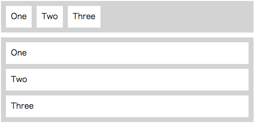

<br>

### <div id="default-width-and-height">デフォルトで適用される幅と高さ</div>

ここではまず Horizontal または Vertical レイアウトで、デフォルトで適用される幅と高さについて見ていきましょう。次のサンプルでは、`<body>`に 3 つの`<div>`がコンテナとして配置されています。

- 1 つ目の`<div>`は子エレメントを 1 つ持ちます。
- 2 つ目の`<div>`は子エレメントを持ちません。
- 3 つ目の`<div>`は子エレメントを 1 つ持ち、また高さが指定されています。

```html
<style scoped>
  .container {
    margin: 10px;
    padding: 5px;
    background-color: lightgray;
  }
  .item {
    background-color: white;
    margin: 5px;
    padding: 10px;
  }
</style>

<template>
  <div>
    <!-- このコンテナは子エレメントを持つ -->
    <div class="layout vertical container">
      <div class="item">One</div>
    </div>
    <!-- このコンテナは子エレメントを持たない -->
    <div class="layout vertical container"></div>
    <!-- このコンテナは子エレメント持ち、高さが指定されている -->
    <div class="layout vertical container" style="height: 150px;">
      <div class="item">One</div>
    </div>
  </div>
</template>
```

まず`<div>`の幅ですが、3 つとも親エレメント(ここではコンポーネント)の幅の中で可能な範囲でストレッチされています。またコンポーネントのサイズが変化しても`<div>`の幅は適切に追従します。

次に`<div>`の高さですが、1 つ目の`<div>`は子エレメントの高さから計算して親である`<div>`の高さが決定されています。2 つ目の`<div>`は子エレメントを持たないため、親である`<div>`がペタンコになっています。3 つ目の`<div>`は指定された高さが適用されています。

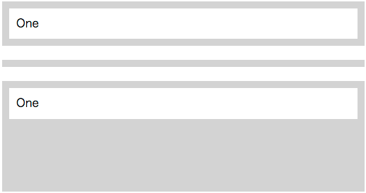

**レイアウトを行う際は次のことを頭に置いておくと良いでしょう**:

- 幅が指定されないコンテナでは、親コンテナの中で可能な範囲で幅がストレッチされる。
- 高さが指定されないコンテナでは、子エレメントの高さを基準にしてコンテナの高さが決定される。
- 高さが指定されたコンテナでは、子エレメントの高さよりコンテナに指定された高さが優先される。

<br>

### <div id="main-and-cross-axis">Main-axis と Cross-axis</div>

コンテナは 2 つの軸を持っています。<term>Main-axis</term> (<term>主軸</term>) は、指定したコンテナに適用した`layout horizontal`や`layout vertical`がこれにあたります。これに対して<term>Cross-axis</term> (<term>交差軸</term>) は、Main-axis に対して垂直な軸となり、Main-axis が Horizontal の場合、Cross-axis は Vertical になります。

**デフォルトでは、子エレメントのサイズは Cross-axis 方向へストレッチされます**:

```html
<div class="layout horizontal" style="height: 150px;">
  <div>Stretch Fill</div>
  <div>Stretch Fill</div>
</div>
<div class="layout vertical" style="height: 150px;">
  <div>Stretch Fill</div>
  <div>Stretch Fill</div>
</div>
```

**レイアウトを行う際は次のことを頭に置いておくと良いでしょう**:

- Main-axis が Horizontal の場合、子エレメントは縦方向へストレッチします:
  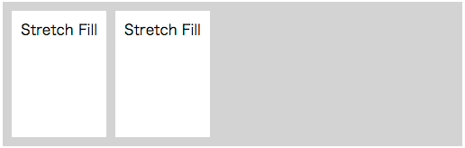

- Main-axis が Vertical の場合、子エレメントは横方向へストレッチします:
  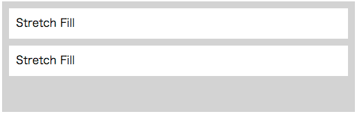

<br>

## <div id="flexible-children">子エレメントのサイズをフレキシブルに制御する</div>

コンテナの子エレメントは、<term>flex</term>を使用することで自身のサイズを制御することができます。

classes:

```html
<div class="layout horizontal">
  <div>One</div>
  <div class="flex">Two (flex)</div>
  <div>Three</div>
</div>
```

placeholder:

```html
<style scoped>
  ...
  .container {
    @extend %layout-horizontal;
  }
  .flexchild {
    @extend %layout-flex;
  }
</style>
<template>
  <div class="container">
    <div>One</div>
    <div class="flexchild">Two (flex)</div>
    <div>Three</div>
  </div>
</template>
```


<br>

---

Horizontal と同様に Vertical でもエレメントのサイズが柔軟に変化します。**ただし Vertical レイアウトではコンテナの`height`に値を指定する必要あります**。指定しない場合はレイアウトが崩れる場合があります:

classes:

```html
<div class="layout vertical" style="height: 250px;">
  <div>One</div>
  <div class="flex">Two (flex)</div>
  <div>Three</div>
</div>
```

placeholder:

```html
<style scoped>
  ...
  .container {
    @extend %layout-vertical;
  }
  .flexchild {
    @extend %layout-flex;
  }
</style>
<template>
  <div class="container" style="height: 250px;">
    <div>One</div>
    <div class="flexchild">Two (flex)</div>
    <div>Three</div>
  </div>
</template>
```

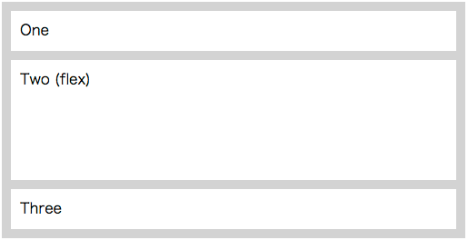

次は`height`に値をしなかった場合にレイアウトが崩れた例です:

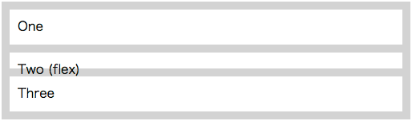

> Note: レイアウトの崩れですが、ブラウザやそのバージョンによっても挙動が異なるようです。

<br>

---

子エレメントのサイズは割合を指定することができます。割合は`flex-2`のように、数字の部分を 1〜12 の範囲で指定します (`flex`は`flex-1`と同意) :

classes:

```html
<div class="layout horizontal">
  <div class="flex-2">One</div>
  <div class="flex">Two</div>
  <div class="flex-3">Three</div>
</div>
```

placeholder:

```html
<style scoped>
  ...
  .container {
    @extend %layout-horizontal;
  }
  .flexchild {
    @extend %layout-flex;
  }
  .flex2child {
    @extend %layout-flex-2;
  }
  .flex3child {
    @extend %layout-flex-3;
  }
</style>
<template>
  <div class="container">
    <div class="flex3child">One</div>
    <div class="flexchild">Two</div>
    <div class="flex2child">Three</div>
  </div>
</template>
```

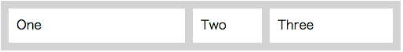

<br>

---

ここではコンテナに子エレメントをフィットさせています。フィットさせるためには以下の性質を利用します:

- 幅のフィットは、<term>flex</term>を指定することによって行う。
- 高さのフィットは、Main-axis が Horizontal の場合に子エレメントが縦方向へストレッチする性質を利用する (詳細は「[Main-axis と Cross-axis](#main-and-cross-axis)」を参照ください) 。

classes:

```html
<div class="layout horizontal" style="height: 150px;">
  <div class="flex">Fit</div>
</div>
```

placeholder:

```html
<style scoped>
  ...
  .container {
    @extend %layout-horizontal;
  }
  .flexchild {
    @extend %layout-flex;
  }
</style>
<template>
  <div class="container" style="height: 150px;">
    <div class="flexchild">Fit</div>
  </div>
</template>
```

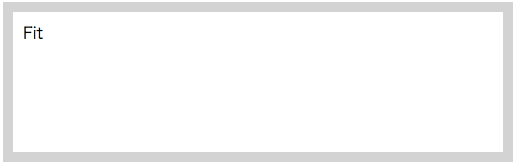

<br>

## <div id="cross-axis-alignment">Cross-axis にエレメントを配置</div>

ここでは Cross-axis にエレメントを配置する方法についてみていきます。

<br>
次のサンプルでは、Cross-axis (Vertical) のstart位置にエレメントを配置しています:

classes:

```html
<div class="layout horizontal start" style="height: 150px;">
  <div>start</div>
  <div>start</div>
</div>
```

placeholder:

```html
<style scoped>
  ...
  .container {
    @extend %layout-horizontal;
    @extend %layout-start;
  }
</style>
<template>
  <div class="container" style="height: 150px;">
    <div>start</div>
    <div>start</div>
  </div>
</template>
```

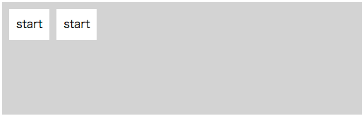

<br>

---

次のサンプルでは、Cross-axis (Vertical) の center 位置にエレメントを配置しています:

classes:

```html
<div class="layout horizontal center" style="height: 150px;">
  <div>center</div>
  <div>center</div>
</div>
```

placeholder:

```html
<style scoped>
  ...
  .container {
    @extend %layout-horizontal;
    @extend %layout-center;
  }
</style>
<template>
  <div class="container" style="height: 150px;">
    <div>center</div>
    <div>center</div>
  </div>
</template>
```

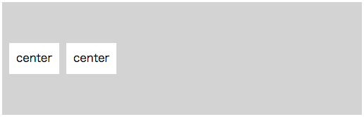

<br>

---

次のサンプルでは、Cross-axis (Vertical) の end 位置にエレメントを配置しています:

classes:

```html
<div class="layout horizontal end" style="height: 150px;">
  <div>end</div>
  <div>end</div>
</div>
```

placeholder:

```html
<style scoped>
  ...
  .container {
    @extend %layout-horizontal;
    @extend %layout-end;
  }
</style>
<template>
  <div class="container" style="height: 150px;">
    <div>end</div>
    <div>end</div>
  </div>
</template>
```

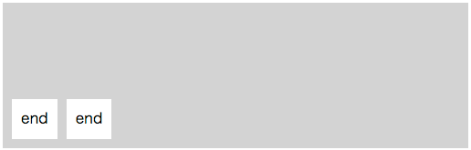

<br>

---

次のサンプルでは、上下左右中央にエレメントを配置しています:

classes:

```html
<div class="layout horizontal center-center" style="height: 150px;">
  <div>center-center</div>
  <div>center-center</div>
</div>
```

placeholder:

```html
<style scoped>
  ...
  .container {
    @extend %layout-horizontal;
    @extend %layout-center-center;
  }
</style>
<template>
  <div class="container" style="height: 150px;">
    <div>center-center</div>
    <div>center-center</div>
  </div>
</template>
```

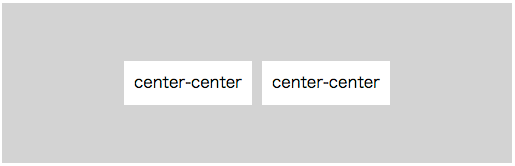

<br>

## <div id="justification">Main-axis にエレメントを配置</div>

ここでは Main-axis にエレメントを配置する方法についてみていきます。

> Note: ここでのサンプルでは、Main-axis (Horizontal) に子エレメントを配置する際、子エレメントが縦方向へストレッチしています。この理由については「[Main-axis と Cross-axis](#main-and-cross-axis)」を参照ください) 。

<br>
次のサンプルでは、Main-axis (Horizontal) のstart位置に子エレメントを配置しています:

classes:

```html
<div class="layout horizontal start-justified" style="height: 100px;">
  <div>start-justified</div>
</div>
```

placeholder:

```html
<style scoped>
  ...
  .container {
    @extend %layout-horizontal;
    @extend %layout-start-justified;
  }
</style>
<template>
  <div class="container" style="height: 100px;">
    <div>start-justified</div>
  </div>
</template>
```

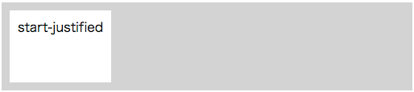

<br>

---

次のサンプルでは、Main-axis (Horizontal) の center 位置に子エレメントを配置しています:

classes:

```html
<div class="layout horizontal center-justified" style="height: 100px;">
  <div>center-justified</div>
</div>
```

placeholder:

```html
<style scoped>
  ...
  .container {
    @extend %layout-horizontal;
    @extend %layout-center-justified;
  }
</style>
<template>
  <div class="container" style="height: 100px;">
    <div>center-justified</div>
  </div>
</template>
```


<br>

---

次のサンプルでは、Main-axis (Horizontal) の end 位置に子エレメントを配置しています:

classes:

```html
<div class="layout horizontal end-justified" style="height: 100px;">
  <div>end-justified</div>
</div>
```

placeholder:

```html
<style scoped>
  ...
  .container {
    @extend %layout-horizontal;
    @extend %layout-end-justified;
  }
</style>
<template>
  <div class="container" style="height: 100px;">
    <div>end-justified</div>
  </div>
</template>
```


<br>

---

次のサンプルでは、Main-axis (Horizontal) のエレメントとエレメント間のスペースが均等になります:

classes:

```html
<div class="layout horizontal justified" style="height: 100px;">
  <div>justified</div>
  <div>justified</div>
  <div>justified</div>
</div>
```

placeholder:

```html
<style scoped>
  ...
  .container {
    @extend %layout-horizontal;
    @extend %layout-justified;
  }
</style>
<template>
  <div class="container" style="height: 100px;">
    <div>justified</div>
    <div>justified</div>
    <div>justified</div>
  </div>
</template>
```


<br>

---

次のサンプルでは、Main-axis (Horizontal) のエレメントの周りのスペースが均等になります:

classes:

```html
<div class="layout horizontal around-justified" style="height: 100px;">
  <div>around-justified</div>
  <div>around-justified</div>
</div>
```

placeholder:

```html
<style scoped>
  ...
  .container {
    @extend %layout-horizontal;
    @extend %layout-around-justified;
  }
</style>
<template>
  <div class="container" style="height: 100px;">
    <div>around-justified</div>
    <div>around-justified</div>
  </div>
</template>
```

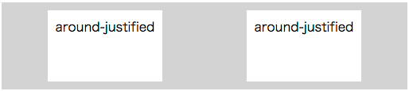

<br>

## <div id="self-alignment">自身のエレメントの配置設定</div>

「[Cross-axis にエレメントを配置](#cross-axis-alignment)」ではコンテナに`start`や`center`などを適用し、子エレメントの配置をしていました。ここでは子エレメントに直接`self-start`や`self-center`などを適用して子エレメントの配置を行います:

classes:

```html
<div class="layout horizontal justified" style="height: 150px;">
  <div class="flex self-start">Alpha</div>
  <div class="flex self-center">Beta</div>
  <div class="flex self-end">Gamma</div>
  <div class="flex self-stretch">Delta</div>
</div>
```

placeholder:

```html
<style scoped>
  ...
  .container {
    @extend %layout-horizontal;
    @extend %layout-justified;
  }
  .child1 {
    @extend %layout-self-start;
    @extend %layout-flex;
  }
  .child2 {
    @extend %layout-self-center;
    @extend %layout-flex;
  }
  .child3 {
    @extend %layout-self-end;
    @extend %layout-flex;
  }
  .child4 {
    @extend %layout-self-stretch;
    @extend %layout-flex;
  }
</style>
<template>
  <div class="container" style="height: 150px;">
    <div class="child1">Alpha</div>
    <div class="child2">Beta</div>
    <div class="child3">Gamma</div>
    <div class="child4">Delta</div>
  </div>
</template>
```

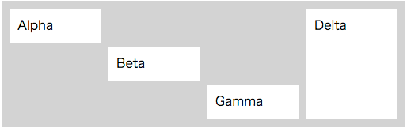

<br>

## <div id="wrapping-layouts">折り返しレイアウト</div>

ここでは収まりきらないエレメントを折り返します。

classes:

```html
<div class="layout horizontal wrap" style="width: 250px;">
  <div>Alpha</div>
  <div>Beta</div>
  <div>Gamma</div>
  <div>Delta</div>
</div>
```

placeholder:

```html
<style scoped>
  ...
  .container {
    @extend %layout-horizontal;
    @extend %layout-wrap;
  }
</style>
<template>
  <div class="container" style="width: 250px;">
    <div>Alpha</div>
    <div>Beta</div>
    <div>Gamma</div>
    <div>Delta</div>
  </div>
</template>
```

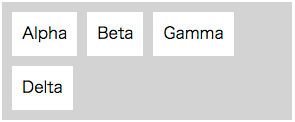

<br>

## <div id="reversed-layouts">リバースレイアウト</div>

ここでは通常とは逆方向にエレメントを配置します。以下はそのクラスの一覧です:

- layout horizontal‑reverse
- layout verical‑reverse
- layout wrap‑reverse

classes:

```html
<div class="layout horizontal-reverse">
  <div>Alpha</div>
  <div>Beta</div>
  <div>Gamma</div>
  <div>Delta</div>
</div>
```

placeholder:

```html
<style scoped>
  ...
  .container {
    @extend %layout;
    @extend %layout-horizontal-reverse;
  }
</style>
<template>
  <div class="container">
    <div>Alpha</div>
    <div>Beta</div>
    <div>Gamma</div>
    <div>Delta</div>
  </div>
</template>
```


<br>

## <div id="general-purpose-rules">汎用的なルール</div>

次のような汎用的なルールも提供されます:

| クラス    | 内容                                   |
| :-------- | :------------------------------------- |
| block     | display: block                         |
| invisible | visibility: hidden                     |
| relative  | position: relative                     |
| fit       | コンテナに子エレメントをフィットさせる |

> Note: `fit`を使用する場合は、祖先でエレメントのサイズが決められてかつ`position: relative`の必要があります。

```html
<div class="layout vertical">
  <div>Before <span>[A Span]</span> After</div>
  <div>Before <span class="block">[A Block Span]</span> After</div>
  <div>Before <span class="invisible">[A Invisible Span]</span> After</div>
  <div class="relative" style="height: 100px;">
    <div class="fit" style="background-color: black; color: white">Fit</div>
  </div>
</div>
```

